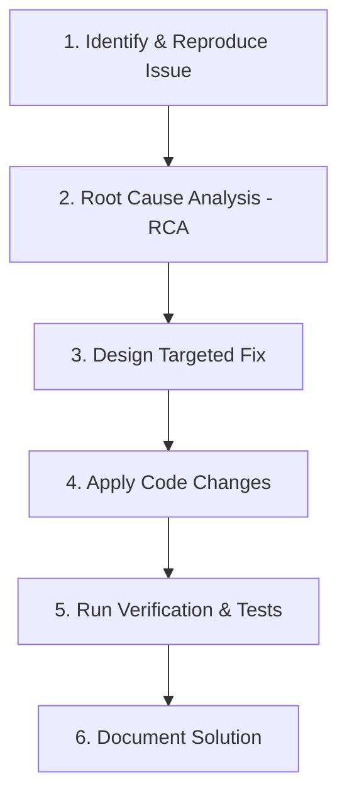

# AGENT.md - Operational & NestJS Best Practices Guide

## 1. Project Context & Objectives

This project is a **NestJS e-commerce backend code challenge**. The application provides RESTful APIs for managing Users, Products, Categories, and Orders with PostgreSQL and Redis caching.

### Primary Directives
- **Goal**: Identify bugs, perform Root Cause Analysis (RCA), fix bugs in-place, optimize performance, and ensure reliability and data consistency.
- **Constraints**:
  - ❌ **Do NOT add new features.**
  - ❌ **Do NOT redesign the core system architecture.**
  - ❌ **Do NOT introduce unnecessary external dependencies.**
  - ✅ **Do focus on best practices**, robustness, clean NestJS design patterns, data integrity, and optimal error handling.
- **Prompt Files Management Directive**:
  - ⚠️ **ALWAYS ask the user for explicit confirmation before generating any new prompt file (`prompt_xxx.md`) in `docs/prompts`.** Never create a `prompt_xxx.md` file automatically without prior user consent.
  - 📌 **Separate Numbering**: Prompt files in `internal_prompts/` and `docs/prompts/` maintain separate incremental numberings starting from `001`.

---

## 2. Tech Stack & Architecture Overview

- **Framework**: NestJS (v11.x) with TypeScript (v5.7.x)
- **Database & ORM**: PostgreSQL with TypeORM (v0.3.x)
- **Cache Layer**: Redis via `@nestjs/cache-manager` and `cache-manager-ioredis-yet`
- **Validation**: `class-validator` and `class-transformer` (`ValidationPipe` with `transform: true` enabled globally in `src/main.ts`)
- **Testing**: Jest (`pnpm test`, `pnpm test:e2e`)

### Module Blueprint
```
src/
├── app.module.ts              # Root module (Database & Cache configuration)
├── main.ts                    # Application bootstrap & global pipes
├── users/
│   ├── user.entity.ts         # User Entity
│   ├── users.controller.ts   # /users routes
│   ├── users.module.ts       # Users Module definition
│   └── users.service.ts      # User CRUD & cache handling
├── products/
│   ├── product.entity.ts      # Product Entity
│   ├── category.entity.ts     # Category Entity (Hierarchical parent/children)
│   ├── products.controller.ts # /products & /categories routes
│   ├── products.module.ts    # Products Module definition
│   └── products.service.ts   # Product search, category tree, batch operations
└── orders/
    ├── order.entity.ts        # Order Entity & OrderStatus enum
    ├── order-item.entity.ts   # Order Item Entity
    ├── orders.controller.ts   # /orders routes
    ├── orders.module.ts       # Orders Module definition
    └── orders.service.ts      # Order processing, payment retry, stock updates
```

---

## 3. NestJS Best Practices & Code Standards

When implementing fixes in future iterations, always strictly follow these NestJS best practices:

### 3.1 Async & Concurrency Control
- **Always `await` promises**: Never trigger fire-and-forget async operations (e.g. `this.productsService.updateStock(...)` without `await`), as this leads to race conditions, unhandled rejections, and state corruption.
- **Proper Promise Handling**: Use `Promise.all` or sequential execution intentionally depending on dependency order.

### 3.2 Database Transactions & Data Integrity (TypeORM)
- **Multi-step Mutations**: Any operation modifying multiple tables (such as creating an order, deducting stock, and saving order items) MUST be executed within a database transaction using TypeORM's `QueryRunner` or `DataSource.transaction()`.
- **Atomic Operations**: Stock updates and inventory decrements should be executed atomically to prevent concurrent stock overdrafts (race conditions).

### 3.3 Cache Strategy & Invalidation (Redis & `@nestjs/cache-manager`)
- **Dynamic Cache Keys**: Cache keys must incorporate request parameters (e.g., `product:search:${query}`) instead of static string keys.
- **Cache Invalidation Lifecycle**: Whenever an entity is mutated (`create`, `update`, `delete`), clear both the individual entity cache key and associated listing/search keys.
- **TTL Units**: Be mindful of cache-manager versions and verify whether TTL is expected in seconds or milliseconds.

### 3.4 Resilient External Calls & Retry Logic
- **Controlled Retries**: Avoid tight `for` loops with huge retry limits (e.g. `1000` attempts with `100ms` sleep). Use exponential backoff with capped jitter and low max retries (e.g., 3-5 attempts).
- **Non-blocking Behavior**: Ensure long-running loops or operations do not block the event loop or hold open HTTP request sockets indefinitely.

### 3.5 Serialization & Circular Reference Prevention
- **Avoid Manual Circular JSON Stringification**: Never call `JSON.stringify` on objects containing circular references (e.g., `enriched.user.latestOrder = enriched`).
- **DTO & Class-Transformer**: Return clean DTOs or entity projections with `@Exclude()` / `@Expose()` decorators to omit circular dependencies during JSON serialization.

### 3.6 Exception Handling & Logging
- **No Swallowed Exceptions**: Never use empty `catch (error) {}` blocks. Always catch specific exceptions, log the failure using NestJS `Logger`, and return appropriate HTTP errors (`BadRequestException`, `NotFoundException`, `InternalServerErrorException`).
- **Informative Error Messages**: Return clear, actionable error messages while preventing sensitive stack trace leaks.

### 3.7 Tree Recursion Safety
- **Recursion Guard**: Prevent stack overflow errors in hierarchical queries (such as `buildCategoryTree`) by guarding against circular parent-child references and missing relations.

---

## 4. Initial Vulnerability & Issue Inventory

Based on full codebase analysis, the following issues are pre-identified for resolution:

| Module | Location | Symptom / Issue Description | Root Cause |
| :--- | :--- | :--- | :--- |
| **Orders** | `orders.service.ts` (`create`) | Race condition / Stock corruptions | `updateStock()` called without `await`; missing DB transaction during order creation. |
| **Orders** | `orders.service.ts` (`processPayment`) | Request timeouts / High CPU usage | Unbounded retry loop (`maxRetries = 1000`) causing HTTP request to block up to 100s. |
| **Orders** | `orders.service.ts` (`getOrderWithFullDetails`) | `TypeError: Converting circular structure to JSON` | Circular reference added (`enriched.user.latestOrder = enriched`) before `JSON.stringify()`. |
| **Products**| `products.service.ts` (`searchProducts`) | Stale / Incorrect search results | Static cache key `'product-search'` ignores the `query` string parameter. |
| **Products**| `products.service.ts` (`buildCategoryTree`) | Potential infinite loop / recursion crash | Unchecked recursive parent tree building on `Category` relations. |
| **Products**| `products.service.ts` (`processProductBatch`) | Silent failures | Swallowed exceptions in `catch` block with only `console.log`. |
| **Users** | `users.service.ts` (`remove`/`create`) | Inconsistent cache invalidation | Incomplete cache key cleanup across all operations. |

---

## 5. Standard Bug-Fixing Iteration Workflow

For each bug fix or improvement request, follow this standard step-by-step workflow:



1. **Reproduction**: Create or run unit/e2e tests (`src/**/*.spec.ts` or `test/**/*.e2e-spec.ts`) that reliably reproduce the issue.
2. **Root Cause Analysis (RCA)**: Trace execution path, examine variable values, check TypeORM query generation, inspect Redis cache states.
3. **Targeted Fix**: Apply minimal, high-impact changes adhering to NestJS best practices.
4. **Verification**: Execute `pnpm test`, `pnpm test:e2e`, and `pnpm build` to confirm fix and ensure zero regressions.
5. **Documentation**: Provide clear markdown summaries of the root cause, fix applied, and test results.

---

## 6. Execution Commands Cheat Sheet

- **Build**: `pnpm build`
- **Unit Tests**: `pnpm test`
- **E2E Tests**: `pnpm test:e2e`
- **Linter**: `pnpm lint`
- **Dev Server**: `pnpm start:dev`
